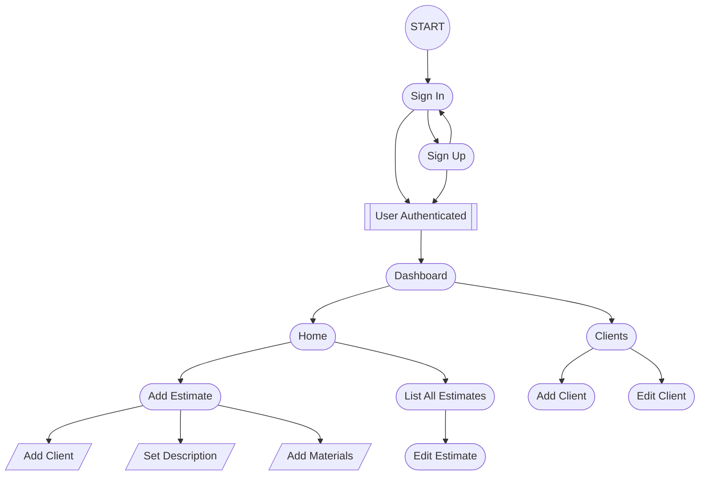
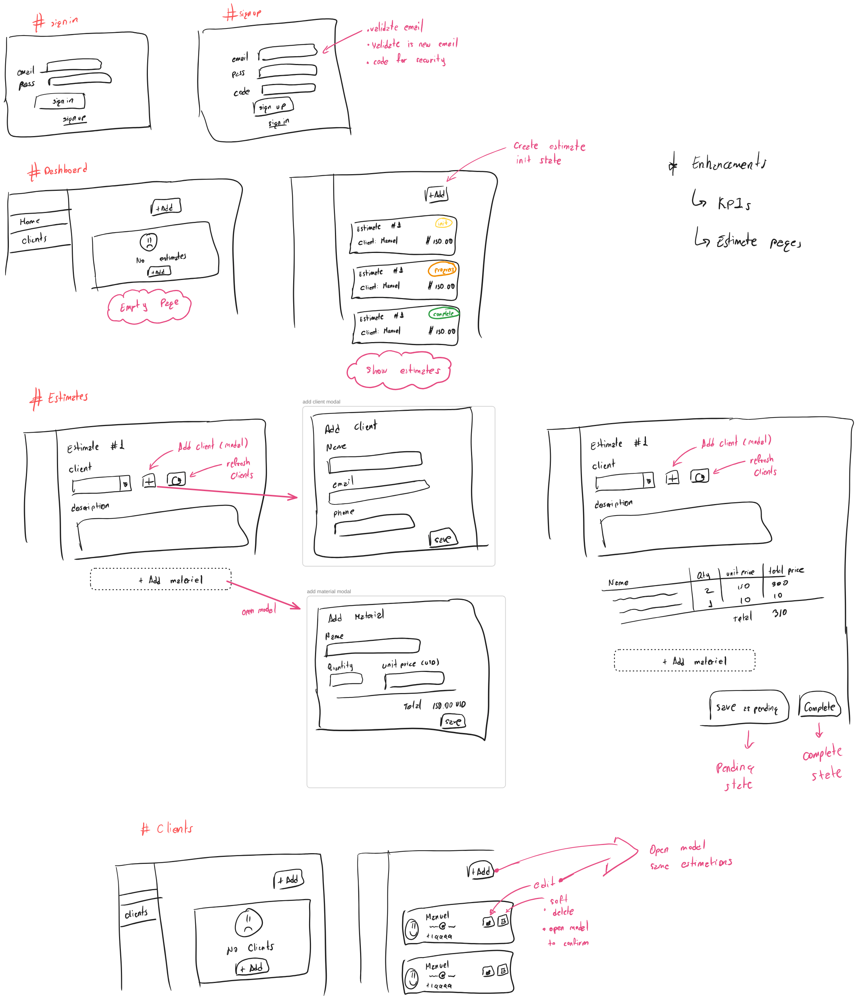
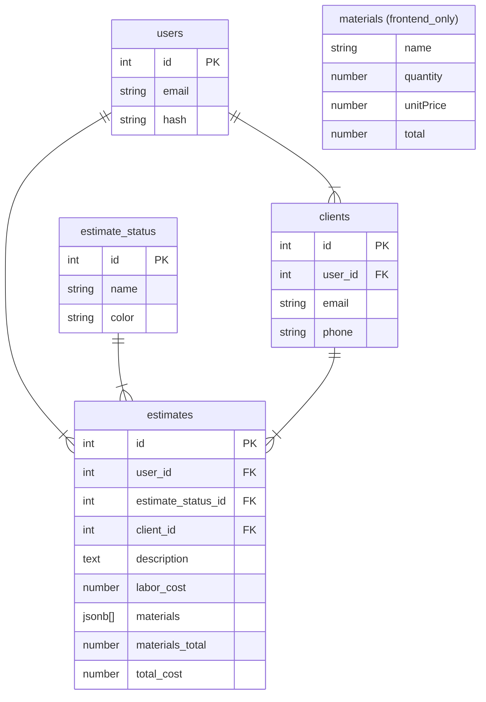
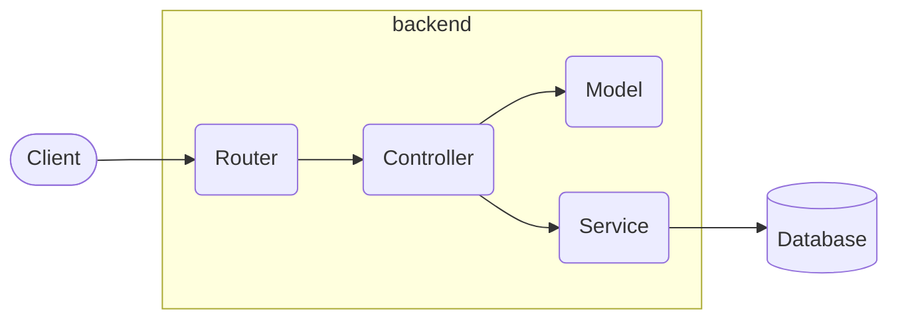
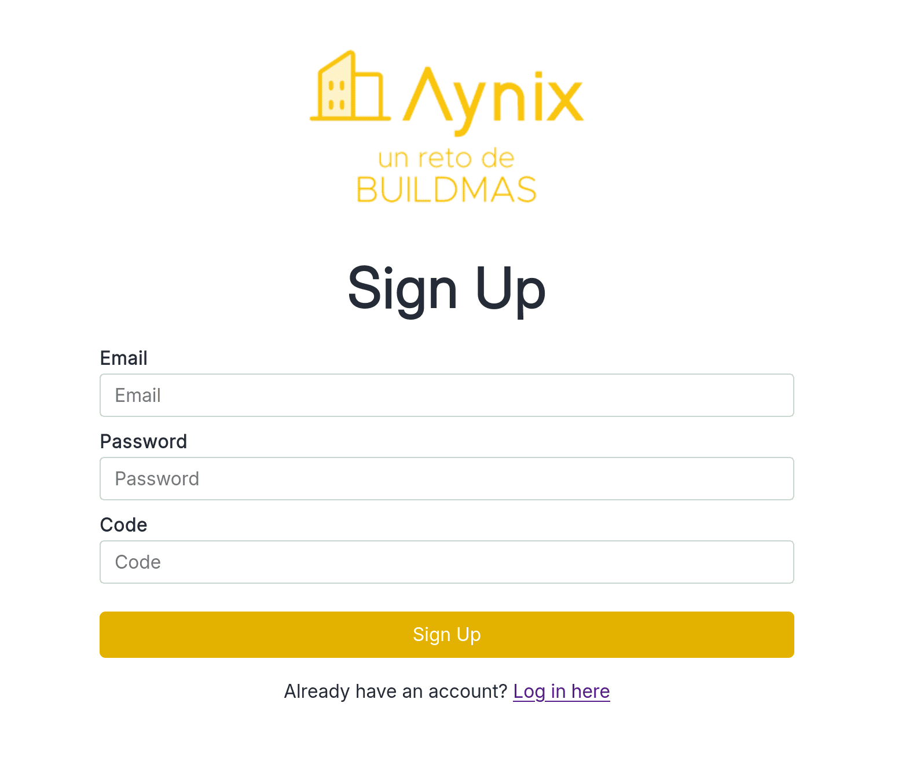
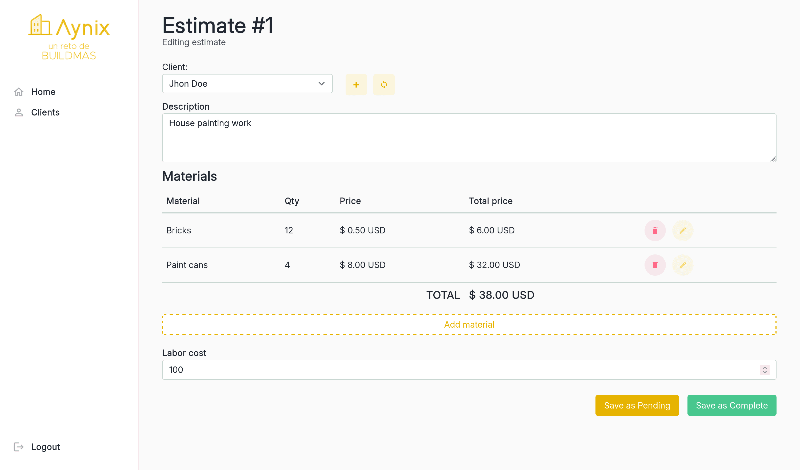

# Ideation


## UI Flows

This document outlines the primary user interface flows for the **Aynix** application, based on the technical challenge of building a web platform for a construction company to manage clients and project estimates.

### Core Features

The first step is analyzing the project to define its core functionalities, which include:

- Sign Up / Sign In
- Dashboard Overview
- Estimates: Create, Read, Update
- Clients: Create, Read, Update

### Flow Diagram

Once the features are outlined, I design the user flow and interactions:



## Wireframes

I then proceed to sketch the main views to visualize the layout and start structuring the data for the database schema.



### Excalidraw

![[Ui flows.excalidraw]]

## Database Schema

With the sketches done and data relationships clearer, I design the ERD:



# Project Structure

## Backend

### Technologies

This project uses:

- [NodeJs](https://nodejs.org)
- [Fastify](https://fastify.dev)
- [tsx](https://tsx.is/)
- [pkgroll](https://github.com/privatenumber/pkgroll)

### Architecture

The backend follows this structure:

- Router: Handles endpoints
- Controller: Contains endpoint logic
- Model: Centralizes model rules and reusable functions
- Service: Interacts with the database



### Scaffolding

```
└──src              # Porject source
	├──controllers  # Controllers
	├──hooks        # Middlewares
	├──migrations   # Scripts for DB migrations
	├──models       # Models
	├──routes       # API Routes
	│ └──v1         # API versioning
	├──services     # Services responsible for interacting with the database
	└──types        # ts types    
```

### Base Project

This project uses a boilerplate I recommend for small projects:  
[https://github.com/pucodev/boilerplate-pucojs-fastify](https://github.com/pucodev/boilerplate-pucojs-fastify)

## Frontend

### Technologies

- [React](https://react.dev/)
- [Vite](https://vite.dev/)
- [React Router](https://reactrouter.com/)

### Architecture

- model: Manages business logic
- api: Connects to the backend
- components/pages: Displays views and UI

### Scaffolding

```
 ├──public          # Static files
 └──src             # Project source
    ├──components   # reutilizable components
    ├──js           
    │  ├──api       # class thath connect to the DB
    │  ├──models    # Models
    │  └──utils     # Utils
    ├──pages        # Principal components
    ├──routes       # Routes management
    └──styles       # Css styles
```

### Base Project

The frontend uses Vite and my styleguide which you can explore here:  
[https://github.com/pucodev/pucoui](https://github.com/pucodev/pucoui)  
Docs: [https://pucodev.github.io/pucoui/docs/intro](https://pucodev.github.io/pucoui/docs/intro)

# Deployment

To run the app in production, it has been dockerized. The `docker/prod` folder contains configurations for both backend and frontend.

For more details:  
[https://github.com/pucodev/aynix#-running-in-production-docker](https://github.com/pucodev/aynix#-running-in-production-docker)

# Develop

For development tracking, I created a [GitHub project](https://github.com/users/pucodev/projects/3) to organize tasks and better manage issues. Additionally, I’m using [Gitflow](https://www.atlassian.com/git/tutorials/comparing-workflows/gitflow-workflow) with `master`, `develop`, and `feature` branches.

# Key Views

## Authentication



Authentication is done via email and password. Passwords are hashed with [bcrypt](https://github.com/kelektiv/node.bcrypt.js).

Upon login, a [JWT](https://github.com/auth0/node-jsonwebtoken) token is issued. Protected routes use middleware to validate this token.

For demo security, a special code is required to create an account.

## Estimate Editing



The estimate update logic includes:

- Estimates start with `initialized` status
- Can only be `completed` if `labor_cost` or `materials` are set
- Materials are stored as JSON (as required) and validated with [zod](https://zod.dev/)

# Project Improvements

1. **[#DB]** Consider merging `users` and `clients` into one table using a flag.
2. **[#DB]** Store materials in a structured DB table instead of JSON.
3. **[#Backend]** Improve auth using a framework or services like [Supertokens](https://supertokens.com/) or [Auth0](https://auth0.com/).
4. **[#Backend]** Validate all endpoints and consider writing unit tests.
5. **[#Frontend]** Add i18n for multilingual support ([i18next](https://react.i18next.com/)).
6. **[#Frontend]** Use [Tanstack Query](https://tanstack.com/query/latest) for scalable API handling.
7. **[#UI/UX]** Improve material creation UX by using inline rows instead of dialog.
8. **[#UI/UX]** Display descriptive error messages.
9. **[#UI/UX]** Show empty states and CTAs when data is missing.