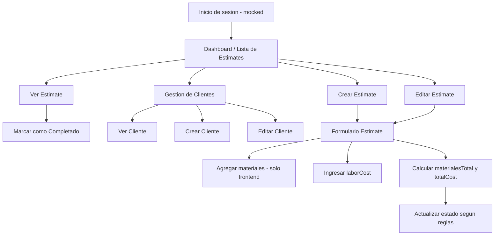
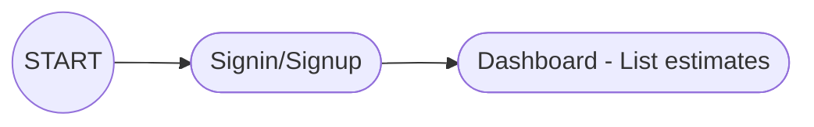

# Flujos de aplicación

```mermaid
graph TD
  Start[Inicio de sesion - mocked]

  Dashboard[Dashboard / Lista de Estimates]
  ViewEstimate[Ver Estimate]
  CreateEstimate[Crear Estimate]
  EditEstimate[Editar Estimate]
  CompleteEstimate[Marcar como Completado]

  Clients[Gestion de Clientes]
  ViewClient[Ver Cliente]
  CreateClient[Crear Cliente]
  EditClient[Editar Cliente]

  CreateEstimateForm[Formulario Estimate]
  AddMaterials[Agregar materiales - solo frontend]
  EnterLaborCost[Ingresar laborCost]
  CalculateTotals[Calcular materialesTotal y totalCost]
  StatusLogic[Actualizar estado segun reglas]
  
  Start --> Dashboard

  Dashboard --> ViewEstimate
  Dashboard --> CreateEstimate
  Dashboard --> EditEstimate

  ViewEstimate --> CompleteEstimate

  CreateEstimate --> CreateEstimateForm
  CreateEstimateForm --> AddMaterials
  CreateEstimateForm --> EnterLaborCost
  CreateEstimateForm --> CalculateTotals
  CalculateTotals --> StatusLogic

  EditEstimate --> CreateEstimateForm

  Dashboard --> Clients
  Clients --> ViewClient
  Clients --> CreateClient
  Clients --> EditClient

```

```mermaid
flowchart LR
	start((START)) --> sign([Signin/Signup])
	sign --> dashboard([Dashboard - List estimates])
```
